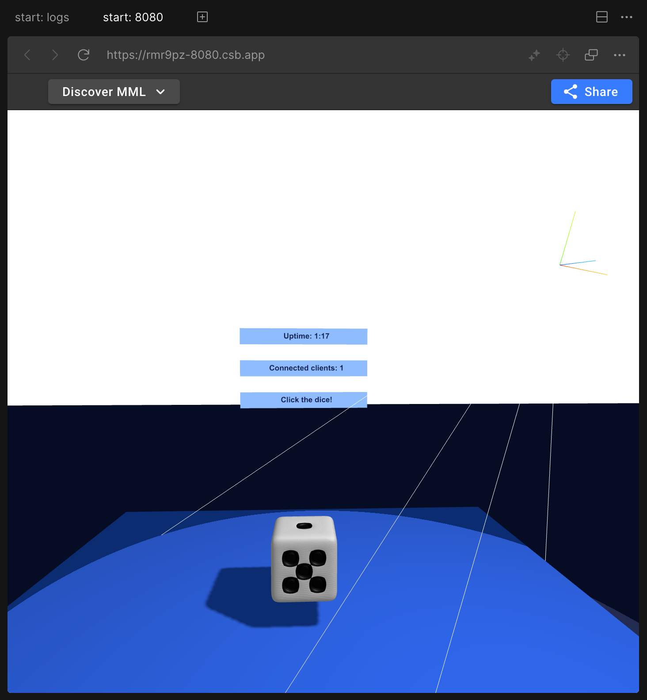

# MML Starter Project

This project is an example of a server that serves a live
[MML (Metaverse Markup Language)](https://mml.io/) document via a WebSocket and reloads it live
during editing. It can be easily deployed to environments that support Node.js and expose ports to
the internet.

The included [mml-document.html](/src/mml-document.html) is the perfect starting point as you
discover MML and start experimenting with your own creations. To dive deeper, please see the
[MML documentation](https://mml.io/docs).

## Run on CodeSandbox

Click the button below to create a new sandbox on CodeSandbox.io.

[](https://codesandbox.io/s/github/mml-io/mml-starter-project)

Once your sandbox is initialized, select the 'start: 8080' tab to view the running document as
pictured below:



## Running locally

Making sure you have Node.js installed, run the following from the root of the repository:

```bash
npm install
npm start
```

Once the server is running, open `http://localhost:8080` in your browser.

## Sharing your creation

If you're running the project on CodeSandbox, simply click the blue 'Share' button and copy the
provided URL.

If you're running it locally, you'll need to expose the server to the internet first so that others
can connect. This can be achieved by creating a tunnel using a tool such as
[ngrok](https://ngrok.com).
